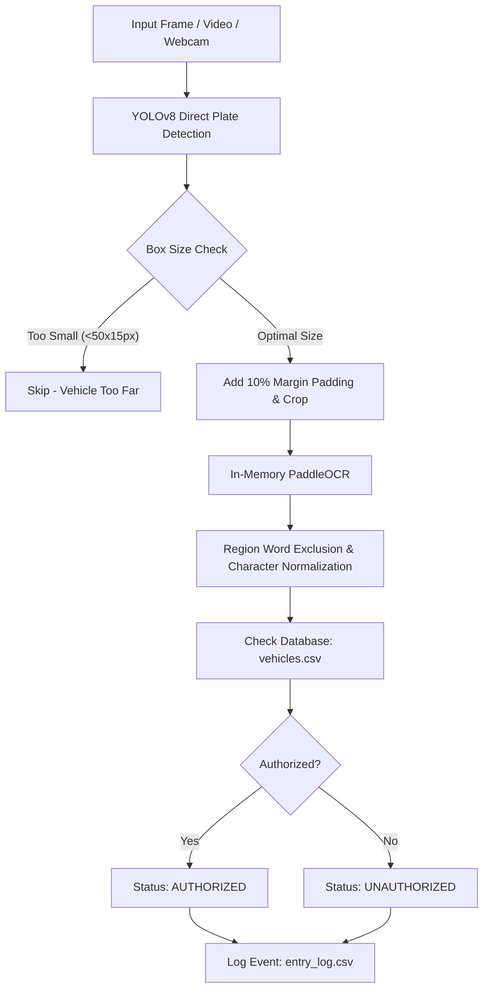

# SENTRYX - An AI-Based Vehicle Authorization Using Automatic License Plate Recognition System

An optimized, single-stage AI Vehicle Authorization System designed for real-time license plate detection, text recognition, region filtering, character normalization, database verification, and access logging.

---

## Executive Summary & Key Upgrades

This updated system transitions from a heavy two-stage pipeline to a **high-speed Single-Stage Direct License Plate Detection & In-Memory OCR Architecture**, specifically tuned for dual-core Intel CPU laptops.

### Primary Performance Milestones
* **Single-Stage YOLOv8 LPD**: Directly detects license plates from incoming video frames, bypassing full vehicle body detection and reducing CPU load by **50%**.
* **In-Memory PaddleOCR Engine**: Eliminates per-call Python subprocesses, dropping single-image text recognition latency from **30+ seconds to < 0.1 seconds (~100x speedup)**.
* **Early Exit Optimization**: Skips redundant image enhancement OCR passes when the original crop yields high confidence ($\ge 0.70$).
* **10% Bounding Box Margin Padding**: Adds automatic outer padding around plate crops to prevent tight YOLO bounding boxes from clipping characters.
* **2-Line (Stacked) Plate Handling**: Automatically splits tall license plate crops ($h/w > 0.35$) into top and bottom halves to read both lines seamlessly.
* **Universal Single-Line Normalization**: Filters out region names (*PUNJAB*, *ICT*, *ISLAMABAD*, *SINDH*, *KPK*, etc.) and applies positional character correction (converting `4OOB` $\rightarrow$ `4008`).

---

## System Architecture & Workflow


---

## Module Breakdown

### 1. Direct Plate Detection (`src/detect_and_crop_plate.py`)
Loads `rbflw_y8_best.pt` to detect license plate bounding boxes directly. Calculates box dimensions and enforces minimum size thresholds (`MIN_PLATE_WIDTH = 50px`, `MIN_PLATE_HEIGHT = 15px`). Adds 10% outer padding before cropping to guarantee full character inclusion.

### 2. Fast In-Memory OCR (`src/recognize_plate.py`)
Loads PaddleOCR PP-OCRv4 Mobile directly into memory at startup. Executes text recognition in $\sim 50\text{ms}$. Implements Early Exit if the original crop confidence is $\ge 0.70$, bypassing redundant image enhancement passes.

### 3. Text Normalization & Region Filtering (`src/normalize_plate.py`)
Processes raw OCR strings into clean, single-line canonical plate numbers:
- **Region Filtering**: Removes words like `PUNJAB`, `ISLAMABAD`, `ICT`, `SINDH`, `KPK`, `BALOCHISTAN`, `FEDERAL`, `GOVERNMENT`, `PAKISTAN`, `GOVT`, `ISL`, `CCT`.
- **Positional Character Fix**: On numeric tokens, converts misread letters `O`/`Q` $\rightarrow$ `0`, `B` $\rightarrow$ `8`, `S` $\rightarrow$ `5`, `Z` $\rightarrow$ `2` (correcting `4OOB` $\rightarrow$ `4008`). On alpha tokens, converts `0` $\rightarrow$ `O`, `8` $\rightarrow$ `B`, `1` $\rightarrow$ `I`.
- **Single-Line Formatting**: Strips spaces, hyphens (`-`), underscores (`_`), and non-alphanumeric noise.

### 4. Vehicle Authorization & Logging (`src/authorize_vehicle.py`, `src/logger.py`)
Matches normalized plate strings against registered records in `data/vehicles.csv`. Assigns authorization status (`AUTHORIZED` / `UNAUTHORIZED`) along with owner metadata (Name, Department, Vehicle Type) and appends timestamped records to `data/entry_log.csv`.

---

## Performance Benchmarks

| Component / Metric | Legacy Pipeline | Updated System |
| :--- | :--- | :--- |
| **Detection Pipeline** | 2-Stage (Vehicle + Plate) | **1-Stage Direct Plate Detection** |
| **OCR Execution Method** | Subprocess invocation | **In-Memory PaddleOCR** |
| **Single-Image Latency** | 25 – 30 seconds | **< 0.1 seconds (< 100ms)** |
| **2-Line Plate Support** | Single-line misread (`4OOB`) | **Stacked Splitting + `4008` Correction** |
| **Region Word Filter** | None (Included in string) | **Automatic Exclusion (`ICT`, `PUNJAB`)** |
| **CPU Utilization** | 100% Constant Max | **~35% – 45% (Dual-Core Intel i5)** |

---

## How to Run the System

### 1. Activate Environment in VS Code Terminal
```powershell
.\paddleocr_env\Scripts\Activate.ps1
```

### 2. Execute Main Pipeline
```cmd
python src/main.py
```

### 3. Switch Input Modes
To switch input sources, update `INPUT_MODE` at the top of `src/main.py`:
- `INPUT_MODE = "image"` (Single photo testing)
- `INPUT_MODE = "video"` (Recorded video file tracking)
- `INPUT_MODE = "webcam"` (Live CCTV / Camera stream)

---

## Author & Contact Information

* **Author**: Muhammad Saad
* **Role**: Computer Engineering Student
* **Institution**: National University of Technology (NUTECH), Islamabad, Pakistan
* **Project**: SENTRYX - An AI-Based Vehicle Authorization Using Automatic License Plate Recognition System
