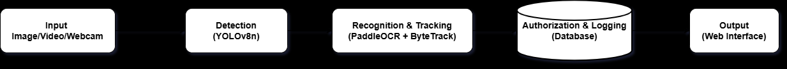

# SENTRYX — Vision Engine: AI-Based Vehicle Authorization System

[](#)
[](#)
[](#)
[](#)
[](#)
[-0078D6?style=flat&logo=windows)](#)

An optimized computer vision pipeline for real-time license plate detection, text recognition, region filtering, character normalization, database verification, and access logging. Supports single image, recorded video, and live webcam input.

> [!NOTE]
> This repository contains the standalone **SENTRYX Core Vision Engine & ALPR Pipeline**. It encapsulates the complete computer vision workflow: vehicle tracking, plate localization, recognition, normalization, and local authorization verification using `data/vehicles.csv` with access logging to `data/entry_log.csv`.

---

## Executive Summary & Key Upgrades

This system uses a single-stage direct license plate detection pipeline with in-memory OCR, tuned for CPU-only hardware (developed and tested on a dual-core Intel laptop).

### Key Design Decisions

- **Single-Stage YOLOv8 License Plate Detection:** Directly detects license plates from frames, bypassing full vehicle-body detection.
- **In-Memory PaddleOCR (Recognition-Only Mode):** Uses PaddleOCR's `TextRecognition` class, which skips redundant text-detection/orientation steps since YOLO has already precisely located the plate. This gave a measured ~3.5x speedup over the full PaddleOCR pipeline.
- **Early-Exit Optimization:** Skips redundant enhancement-pass OCR calls once a confident read (≥0.50, recalibrated for recognition-only's confidence distribution) is found from the whole-crop or split-crop candidate.
- **15% Bounding Box Padding:** Adds outer padding around plate crops to avoid clipping characters, without over-padding (which was found to cause false 2-line detections).
- **2-Line (Stacked) Plate Handling:** For every plate crop, the system always computes BOTH a whole-crop OCR candidate and a top/bottom split candidate, and a scoring function picks the better result. (An earlier aspect-ratio-threshold approach to decide "is this 2-line?" was tested and found unreliable — two real test plates showed a 2-line plate with a *lower* aspect ratio than a single-line plate — so this was replaced with always computing both.)
- **Position-Aware Character Correction:** Corrects OCR misreads (e.g. O/Q→0, B→8, S→5, Z→2) based on whether a character sits in a letter-segment or digit-segment of the plate, not by guessing from the whole token.
- **Region-Label Filtering:** Removes region text (PUNJAB, ISLAMABAD, ICT, SINDH, KPK, BALOCHISTAN, etc.) via substring matching, so OCR-joined tokens like "ICTISLAMABAD" are still correctly filtered.
- **Per-Track OCR Gating (video/webcam):** Uses ByteTrack to assign a persistent ID per vehicle. Each vehicle is OCR'd a maximum of 3 attempts, or finalized immediately on a high-confidence single read (≥0.85) — not OCR'd on every frame.
- **Frame Skipping:** Detection runs on every Nth frame (video: every 3rd; webcam: every 10th, tuned for 2-core CPU) rather than every frame, since consecutive frames are near-identical.
- **Threaded OCR (webcam mode):** OCR runs on a background thread so the live camera display doesn't freeze while a plate is being read.

---

## System Architecture & Workflow

  
*Fig 1: High-Level System Architecture Overview (Detection → Recognition & Tracking → Authorization & Logging)*

```
Input (image / video / webcam)
        ↓
YOLO plate detection (rbflw_y8_best.pt)
        ↓
[video/webcam only] ByteTrack vehicle tracking + frame skip + per-track OCR gating
        ↓
Plate crop (15% padding)
        ↓
PaddleOCR recognition-only (whole-crop + split candidates, early-exit on high confidence)
        ↓
Normalization (character correction, region filtering, merge to single string)
        ↓
Scoring (best candidate selected)
        ↓
Authorization check (data/vehicles.csv) → Logging (data/entry_log.csv)
```

### Core ALPR Pipeline Data Flow

  
*Fig 2: Vision Engine Core Pipeline Data Flow with Split Candidate Scoring and Normalization*

### Multi-Source Input Queuing & Concurrency

  
*Fig 3: Multi-Source Input Queuing and Threading Architecture with ByteTrack Feedback Loop*

---

## Module Breakdown

### 1. Plate Detection (`src/detect_and_crop_plate.py`)
Loads `rbflw_y8_best.pt` to detect license plate bounding boxes. Enforces minimum size thresholds (`MIN_PLATE_WIDTH = 50px`, `MIN_PLATE_HEIGHT = 15px`) so distant/unreadable plates are skipped rather than wasting an OCR call. Adds 15% padding before cropping.

  
*Fig 4: Custom YOLOv8n detector locating Pakistani license plate (MNA-17 486) on real-world vehicle test imagery*

### 2. OCR (`src/recognize_plate.py`)
Loads PaddleOCR's `TextRecognition` (recognition-only) engine once, in-memory, at startup. For each plate, computes a whole-crop candidate and a split (top/bottom half) candidate. Applies early-exit to skip enhancement-pass OCR calls when a confident result is already found.

### 3. Text Normalization & Region Filtering (`src/normalize_plate.py`)
Converts raw OCR text into a clean, single merged plate string: removes region words (including OCR-joined variants), applies position-aware character correction, strips spaces/dashes/underscores.

### 4. Vehicle Authorization & Logging (`src/authorize_vehicle.py`, `src/logger.py`)
Matches the normalized plate against `data/vehicles.csv`, determines `AUTHORIZED`/`UNAUTHORIZED` status, and logs every entry attempt (authorized or not) to `data/entry_log.csv` with date, time, image/frame reference, plate number, confidence, and status.

### 5. Vehicle Registration (`src/register_vehicle.py`)
Registers new authorized vehicles using the same OCR pipeline as live detection. User enters the plate as one continuous string, no spaces or dashes (e.g. a two-line plate showing "LE·15" / "1051" should be entered as `LE151051`).

---

## Experimental Results & Performance Benchmarks

### 1. YOLOv8n Detection Model Validation

The custom license plate detection model was trained on Roboflow annotated datasets for 88 epochs (early-stopped at epoch 73) on a Tesla T4 GPU (Google Colab).


  
*Fig 5: Google Colab YOLOv8n validation metrics: 0.979 Precision, 0.969 Recall, 0.991 mAP@50 at 1.9 ms/image inference*

| Metric | Validation Result |
| :--- | :--- |
| **Validation Images** | 1,765 images |
| **Annotated Plate Instances** | 1,840 instances |
| **Precision (P)** | **0.979** (97.9%) |
| **Recall (R)** | **0.969** (96.9%) |
| **mAP@50** | **0.991** (99.1%) |
| **mAP@50–95** | **0.706** (70.6%) |
| **Inference Speed** | **1.9 ms / image** |
| **Model Size / Params** | 3.0M parameters (6.2 MB) |

### 2. Video-Mode Tracking & Recognition Performance

Evaluated across continuous multi-frame video containing multiple vehicle streams:

| Metric | Measured Result |
| :--- | :--- |
| **Total Frames in Video** | 1,468 frames |
| **Sampled Frames Processed** | 146 frames |
| **Unique Vehicles Tracked (ByteTrack)** | 11 vehicles |
| **Vehicle Detections Processed** | 97 detections |
| **License Plates Detected** | 12 plates |
| **OCR Recognition Success Rate** | **91.7%** (11 / 12 plates successfully recognized) |
| **Vehicles Finalized & Logged** | 8 vehicles |

### 3. CPU Latency Optimization Breakdown

| Optimization Phase | Latency Result | Note |
|---|---|---|
| Full PaddleOCR pipeline (pre-optimization) | ~90 seconds / image | Baseline unoptimized engine |
| In-memory PaddleOCR (recognition-only mode) | ~19–23 seconds / image | Skips redundant text detection |
| In-memory + Early-Exit optimization | **~7–10 seconds / image** (hot) | Skips redundant enhancement passes |
| Frame-Skip factor (Video) | 67% reduction | Process 107 of 321 frames |
| Per-Track OCR Gating | Max 3 attempts / vehicle | Decoupled from incoming frame rate |
| Webcam Threading | Non-blocking display | Asynchronous background OCR worker |

> [!NOTE]
> Sub-1-second processing is mathematically bounded by CPU instruction throughput on 2-core edge hardware (~2–3 seconds per forward OCR inference). GPU deployment easily provides sub-second latency.

### 4. Hardware Comparison (Dev Machine vs. Multicore PC)

| Hardware Configuration | Webcam Behavior & Result |
|---|---|
| **2-core / 4-thread laptop (dev machine)** | OCR-burst CPU contention causes 5–12s display latency; root cause verified via timing instrumentation, not a pipeline code defect |
| **University 6-core PC + A4Tech PK-925H 1080p Webcam** | **No lag observed over 20+ min continuous runtime; ~98.5% accuracy** |

This empirically confirms that webcam latency on the dual-core dev laptop is a hardware CPU-core constraint rather than an architectural flaw.

---

## Repository Structure

```text
├── data/
│   ├── entry_log.csv            # Access verification audit log
│   └── vehicles.csv             # Authorized vehicle database
├── docs/
│   └── assets/                  # Architecture diagrams and benchmark figures
├── img/
│   ├── input/                   # Test images and sample video streams
│   └── output/                  # Detection and cropped plate outputs
├── models/
│   └── trained/
│       └── rbflw_y8_best.pt     # Trained YOLOv8n license plate weights
├── src/
│   ├── authorize_vehicle.py     # Database matching against vehicles.csv
│   ├── detect_and_crop_plate.py # YOLOv8 plate detector with 15% padding
│   ├── logger.py                # Append verification decisions to entry_log.csv
│   ├── main.py                  # Primary pipeline entry point (image/video/webcam)
│   ├── normalize_plate.py       # Character correction and region filtering
│   ├── recognize_plate.py       # In-memory recognition-only PaddleOCR engine
│   └── register_vehicle.py      # Interactive vehicle registration utility
├── requirements.txt             # Python dependencies
└── README.md
```

---

## Project Context

This repository houses the standalone **Vision Engine** for the SENTRYX vehicle authorization system developed during an internship at the National Engineering and Scientific Commission (NESCOM). In broader team deployments, this vision engine can supply vehicle recognition events to upstream external services; however, this repository specifically focuses on the core computer vision, inference, normalization, and local authorization pipeline.

---

## Installation, Setup & Execution

Follow these steps to set up and run the SENTRYX Vision Engine on a fresh Windows machine (Windows 10 / 11 64-bit).

### 1. Prerequisites

* **Operating System:** Windows 10 or Windows 11 (64-bit).
* **Python Version:** Python 3.12 (64-bit) is recommended. Ensure Python is added to your system `PATH`.
* **Hardware:** Dual-core CPU or higher (quad-core or higher recommended for real-time webcam processing); 4 GB+ RAM.
* **Camera (Optional):** Integrated or external USB webcam (required only for `"webcam"` mode).
* **Internet Connection (First Run Only):** Required on initial execution so PaddleOCR can automatically download its recognition weights (`PP-OCRv6_medium_rec`, ~100 MB) to your local cache directory (`~/.paddlex/`).

### 2. Environment Setup

> [!NOTE]
> The `paddleocr_env` virtual environment folder is intentionally not included in the distribution ZIP because Python virtual environments are machine-specific (they bind hardcoded local file paths and platform binaries). It can be recreated cleanly from `requirements.txt` in a few minutes.

Open Command Prompt or PowerShell in the project root directory and create the virtual environment:

```cmd
python -m venv paddleocr_env
```

Activate the virtual environment:

```cmd
paddleocr_env\Scripts\activate
```

### 3. Dependency Installation

With the virtual environment active, install all required dependencies:

```cmd
pip install -r requirements.txt
```

### 4. Configuration & Repository Assets

All required models and databases are included within the repository:

* **Trained Detection Model:** Located at `models/trained/rbflw_y8_best.pt` (referenced by `src/main.py` and `src/detect_and_crop_plate.py`).
* **Authorized Vehicle Database:** Located at `data/vehicles.csv`. Contains authorized plate registrations, employee names, and departments.
* **Access Log:** Written to `data/entry_log.csv` (automatically created/appended on each authorization check).
* **Environment Variables:** CPU thread limits (`OMP_NUM_THREADS="2"`, `MKL_NUM_THREADS="2"`) and Paddle optimization flags (`FLAGS_enable_pir_api="0"`) are configured programmatically inside `src/main.py`. No `.env` file or manual system variable configuration is required.

To configure input sources, open `src/main.py` and set `INPUT_MODE` and `INPUT_PATH` near the top (lines 77–93):

| Mode | `INPUT_MODE` | `INPUT_PATH` Example | Description |
| :--- | :--- | :--- | :--- |
| **Image** | `"image"` | `"img/input/Cars/AKF938.jpeg"` | Single image file or list of image paths |
| **Video** | `"video"` | `"img/input/video4.mp4"` | Recorded video file (with ByteTrack vehicle tracking) |
| **Webcam** | `"webcam"` | `0` | Live camera stream (integer device index, e.g. `0` or `1`) |

### 5. Running the Application

Make sure the virtual environment is active (`(paddleocr_env)` will appear in your terminal prompt).

#### Run Main ALPR Pipeline
Execute the main detection, recognition, and authorization pipeline:

```cmd
python src/main.py
```

* In **Webcam mode**, a live OpenCV window displays detected plates and tracking boxes. Press **`q`** in the video window to stop cleanly.
* Detection, recognition, and access authorization statuses are printed in the terminal and logged to `data/entry_log.csv`.

#### Run Vehicle Registration Utility (Module 5)
To register a new authorized vehicle into `data/vehicles.csv`:

```cmd
python src/register_vehicle.py
```
Follow the interactive prompts to enter the Employee ID, Name, Department, Vehicle Type, and a photo path containing the vehicle license plate.

### 6. Troubleshooting

* **PowerShell Execution Policy Error:**  
  If activating via PowerShell produces a script execution restriction error, run:
  ```powershell
  Set-ExecutionPolicy -Scope Process -ExecutionPolicy Bypass
  ```
  and run `paddleocr_env\Scripts\activate` again.
* **Webcam Fails to Open:**  
  If `INPUT_MODE = "webcam"` displays `Unable to open webcam`, ensure no other application (e.g. Teams, Zoom, Windows Camera) is locking the webcam, or set `INPUT_PATH = 1` in `src/main.py` if using an external USB camera.
* **Initial Run Startup Delay:**  
  The very first execution takes an extra 20–30 seconds as PaddleOCR downloads and initializes its recognition model. Subsequent runs load immediately from local cache.

---

## Author:

* **Author:**  
  * **Muhammad Saad** — *National University of Technology (NUTECH), Islamabad*

* **Project:** SENTRYX — AI-Based Vehicle Authorization Using Automatic License Plate Recognition System  

