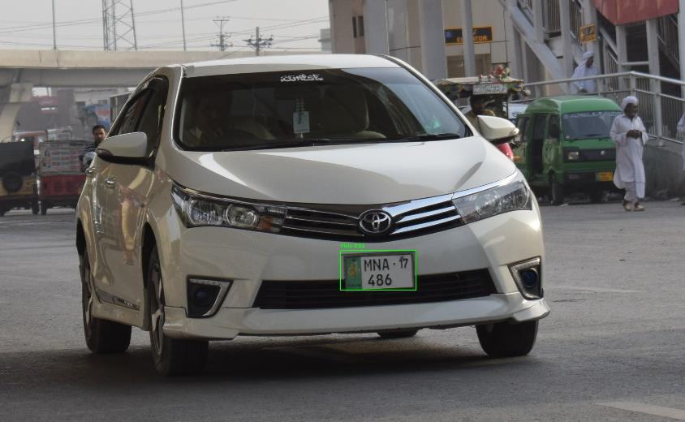
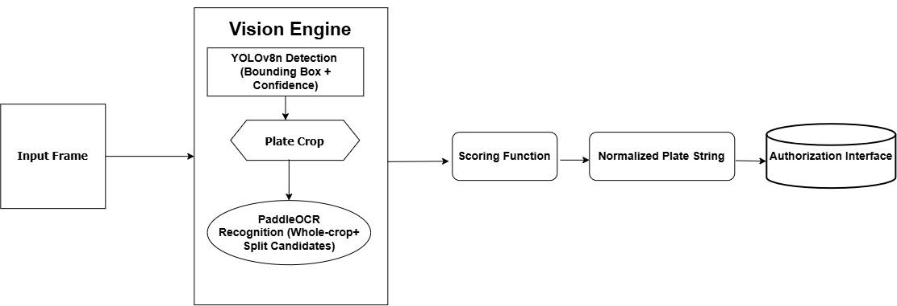
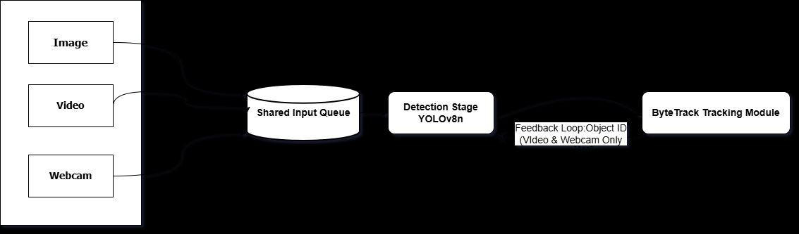
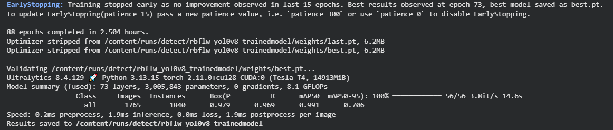

# SENTRYX

**Real-Time Automatic License Plate Recognition & Vehicle Authorization Engine**

[](#)
[](#)
[](#)
[](#)
[](#)
[](#)

  
*YOLOv8n detecting a Pakistani license plate (MNA-17 486) on real-world vehicle test imagery.*

---

## What is SENTRYX?

Manual checkpoint inspection creates severe entry bottlenecks, transcription errors, and unlogged perimeter access. SENTRYX is an autonomous computer vision system designed to automate vehicle access control by localizing license plates, reading alphanumeric characters, normalizing regional formatting, and validating authorization against a secure local registry in real time.

This repository houses the **core vision and inference engine** of SENTRYX. Built specifically for edge hardware, it couples a custom-trained YOLOv8n detector with an in-memory, recognition-only PaddleOCR pipeline and ByteTrack multi-object tracking. The engine supports single images, recorded video streams, and live webcam feeds on CPU-only machines without requiring dedicated GPU infrastructure.

---

## Pipeline Architecture

```mermaid
flowchart LR
    Input["Input Source<br/>(Image / Video / Webcam)"] --> Det["YOLOv8n Detector<br/>(Plate Localization)"]
    Det --> Track{"Video / Webcam?"}
    Track -- Yes --> BT["ByteTrack<br/>(Temporal Tracking)"]
    BT --> Gate["Per-Track Gating<br/>(Max 3 Attempts)"]
    Gate --> Crop["15% Padded Crop"]
    Track -- No --> Crop
    Crop --> OCR["PaddleOCR<br/>(Recognition-Only)"]
    OCR --> Split["Dual-Candidate Generation<br/>(Whole Crop + Split Half)"]
    Split --> Score["Scoring & Normalization<br/>(Position-Aware Correction)"]
    Score --> Auth["Authorization Check<br/>(data/vehicles.csv)"]
    Auth --> Log["Audit Logging<br/>(data/entry_log.csv)"]
```



*High-level system architecture: detection, tracking, recognition, normalization, and local authorization logging.*

---

## The Vision Pipeline

### 1. Plate Detection
A custom-trained YOLOv8n detector (`models/trained/rbflw_y8_best.pt`) localizes license plates directly in the raw camera frame, bypassing full vehicle-body detection cascades. Detected bounding boxes are padded by 15% margins to protect boundary characters from clipping. Low-resolution or distant plates (< 50x15 pixels) are filtered out automatically to conserve OCR compute.

### 2. Temporal Tracking (Video & Webcam)
ByteTrack assigns persistent track IDs to vehicles across sequential frames. Rather than running expensive OCR on every frame, the pipeline gates recognition to a maximum of 3 attempts per tracked vehicle. If a single read reaches high confidence (≥ 0.85 in video, ≥ 0.60 in webcam), the track is finalized immediately, preventing redundant computation.

### 3. Recognition-Only OCR
Instead of running a full OCR pipeline with text detection and orientation classification, SENTRYX uses PaddleOCR's in-memory `TextRecognition` model directly on the localized plate crop. Because YOLO has already determined the plate coordinates, skipping text localization yields a ~3.5x speedup.

### 4. Two-Line & Stacked Plate Handling
Pakistani plates frequently feature stacked layouts (e.g., province/year on the upper line, registration digits on the lower line). Rather than relying on fragile aspect-ratio heuristics, the engine evaluates both a full-crop candidate and a split-line candidate (top half + bottom half) for every detection, using a scoring function to pick the superior result.

### 5. Position-Aware Normalization
Extracted tokens are scrubbed of regional words (`PUNJAB`, `ISLAMABAD`, `ICT`, `SINDH`, `KPK`, etc.) using substring matching to eliminate joined artifacts (e.g. `ICTISLAMABAD`). Position-aware character correction detects the boundary between alphabetical prefixes and registration digits, correcting OCR confusion (e.g. O/Q→0, B→8, S→5, Z→2) only in the numeric zone while protecting valid letters.

### 6. Authorization & Audit Logging
The clean plate string is verified against `data/vehicles.csv`. Every verification attempt is atomically appended to `data/entry_log.csv` with a timestamp, frame reference, confidence score, and authorization status (`AUTHORIZED` or `UNAUTHORIZED`).

---

## Engineering Highlights

| Challenge | Engineering Solution | Rationale |
| :--- | :--- | :--- |
| **Full OCR Latency on CPU** | Switched from full PaddleOCR to in-memory `TextRecognition` | Skips redundant text detection on already-cropped plates, cutting latency by ~3.5x. |
| **Stacked / Two-Line Plates** | Dual-candidate generation (whole-crop + split-half) scored via regex | Aspect-ratio thresholds failed on real plates; generating and scoring both candidates reliably handles stacked text. |
| **Character Confusion (O/0, B/8, S/5)** | Position-aware correction based on letter-to-digit boundary | Whole-string character replacement corrupts valid alphabet prefixes; restricting conversion to digit zones preserves valid letters. |
| **Redundant Video OCR Calls** | ByteTrack vehicle tracking with a 3-attempt gating cap | Vehicles in consecutive frames are identical; tracking ensures each vehicle is processed at most 3 times or until high confidence. |
| **Live Camera Freezes on Edge CPU** | Asynchronous background OCR worker thread with task queue | Running 2-second OCR inference on the main thread blocked OpenCV rendering; decoupling capture from OCR ensures smooth video display. |
| **CPU Starvation on Multi-Threading** | Programmatic thread capping (`OMP_NUM_THREADS="2"`, etc.) | Unbounded BLAS/MKL threads monopolize all CPU cores during OCR bursts; capping preserves headroom for the YOLO detector. |

---

## Visual Results

### Vision Pipeline Data Flow
  
*Detailed data flow from input frame through plate crop, dual-candidate generation, scoring, and normalization.*

### Multi-Source Concurrency Architecture
  
*Queued architecture decoupling image, video, and webcam ingestion from detection and tracked OCR workers.*

### Detector Training Performance
  
*Validation metrics from custom YOLOv8n training on 1,765 images: 0.979 Precision, 0.969 Recall, and 0.991 mAP@50.*

---

## Performance & Benchmarks

### 1. License Plate Detection (Validation Set)

Evaluated on a held-out test split of 1,765 images and 1,840 annotated plate instances:

| Metric | Measured Value |
| :--- | :--- |
| **Precision (P)** | **0.979** (97.9%) |
| **Recall (R)** | **0.969** (96.9%) |
| **mAP@50** | **0.991** (99.1%) |
| **mAP@50–95** | **0.706** (70.6%) |
| **Detector Inference Speed** | **1.9 ms / image** (Tesla T4 GPU) / ~150 ms (CPU) |
| **Model Size** | 3.0M parameters (6.2 MB) |

### 2. Multi-Frame Video Tracking Performance

Evaluated across a continuous video sequence containing multiple vehicle entries:

| Metric | Result |
| :--- | :--- |
| **Total Frames** | 1,468 frames |
| **Sampled Frames (Frame-Skip = 3)** | 146 frames |
| **Unique Vehicles Tracked (ByteTrack)** | 11 vehicles |
| **License Plates Detected** | 12 plates |
| **OCR Recognition Success Rate** | **91.7%** (11 / 12 plates successfully read) |
| **Finalized Vehicles Logged** | 8 vehicles |

### 3. CPU Latency Optimization Progression

Measured on a standard dual-core development laptop:

| Pipeline Stage | Latency | Engineering Impact |
| :--- | :--- | :--- |
| Baseline Full PaddleOCR Pipeline | ~90 s / image | Unoptimized full text-detection + recognition |
| In-Memory Recognition-Only Mode | ~19–23 s / image | Bypasses text detection stage |
| Recognition-Only + Early-Exit Optimization | **~7–10 s / image** | Skips enhancement passes once confident read is obtained |
| Multi-Core PC (6-Core Intel + 1080p Webcam) | **Real-Time (~30 FPS)** | Confirms smooth, non-blocking performance with adequate core count |

---

## Tech Stack

| Component | Technology | Role |
| :--- | :--- | :--- |
| **Runtime** | Python 3.12 (64-bit) | Core execution environment |
| **Object Detection** | YOLOv8n (Ultralytics) | Custom-trained license plate detector |
| **Character Recognition** | PaddleOCR (PP-OCRv6) | In-memory text recognition engine |
| **Multi-Object Tracking** | ByteTrack | Persistent vehicle tracking across video frames |
| **Computer Vision** | OpenCV (`cv2`) | Frame ingestion, cropping, preprocessing, and display |
| **Data Processing** | NumPy, Pandas | Candidate matrix evaluation and CSV database lookups |

---

## Installation & Setup

### Prerequisites
* Windows 10 or 11 (64-bit)
* Python 3.12 (64-bit) added to system `PATH`
* Dual-core CPU or higher (quad-core recommended for webcam mode); 4 GB+ RAM
* Internet connection on first execution (to auto-download PaddleOCR weights, ~100 MB)

### 1. Clone the Repository
```cmd
git clone https://github.com/Im-Saad08/AI-Based-Vehicle-Authorization-Using-Automatic-License-Plate-Recognition-System.git
cd AI-Based-Vehicle-Authorization-Using-Automatic-License-Plate-Recognition-System
```

### 2. Create and Activate Virtual Environment
```cmd
python -m venv paddleocr_env
paddleocr_env\Scripts\activate
```

### 3. Install Dependencies
```cmd
pip install -r requirements.txt
```

---

## Usage

### Run Main ALPR Pipeline
Configure your input mode and execute the vision engine:

```cmd
python src/main.py
```

* In **Webcam mode**, a live OpenCV preview displays detected plates and bounding boxes. Press **`q`** to cleanly exit.
* In **Image/Video mode**, detection and authorization decisions are printed to the console and logged to `data/entry_log.csv`.

### Register a New Authorized Vehicle
To register a new vehicle into the authorization database:

```cmd
python src/register_vehicle.py
```
Follow the interactive terminal prompts to input Employee ID, Name, Department, Vehicle Type, and a photo path. The tool detects and verifies the plate automatically.

---

## Configuration

Input source and pipeline parameters are configured near the top of `src/main.py` (lines 75–105):

| Parameter | Options / Type | Description |
| :--- | :--- | :--- |
| `INPUT_MODE` | `"image"`, `"video"`, `"webcam"` | Active ingestion source |
| `INPUT_PATH` | File path or device index (`0`) | Target image/video file or camera index |
| `FRAME_SKIP` | Integer (e.g. `3` or `10`) | Frame processing interval (tune for available CPU cores) |
| `MAX_OCR_ATTEMPTS_PER_TRACK` | Integer (default: `3`) | Maximum OCR attempts per tracked vehicle |
| `HIGH_CONFIDENCE_ACCEPT` | Float (default: `0.85`) | Confidence threshold for single-read track finalization |

---

## Limitations

* **CPU Latency Bounds:** On entry-level dual-core CPUs, single OCR forward passes take ~2–3 seconds. Multi-core processors or dedicated GPU acceleration are required for sub-second live streaming.
* **Extreme Angles:** Detection bounding-box accuracy loosens on steep oblique angles (> 45°), which can degrade plate crop quality.

---

## Project Scope & Context

This repository contains the standalone **Computer Vision Engine & Inference Pipeline** for SENTRYX. 

In broader multi-developer deployments, this vision engine supplies recognition events to upstream web platforms. Presentation dashboards, FastAPI services, and PostgreSQL databases developed by teammates are maintained in separate repositories and are outside the scope of this codebase.

---

## Author

* Muhammad Saad  
  *Computer Engineering, National University of Technology (NUTECH), Islamabad, Pakistan*

